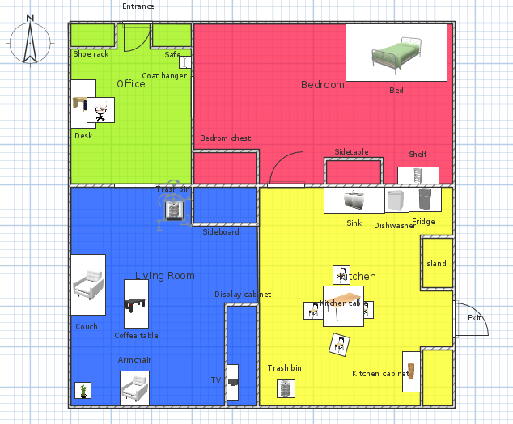
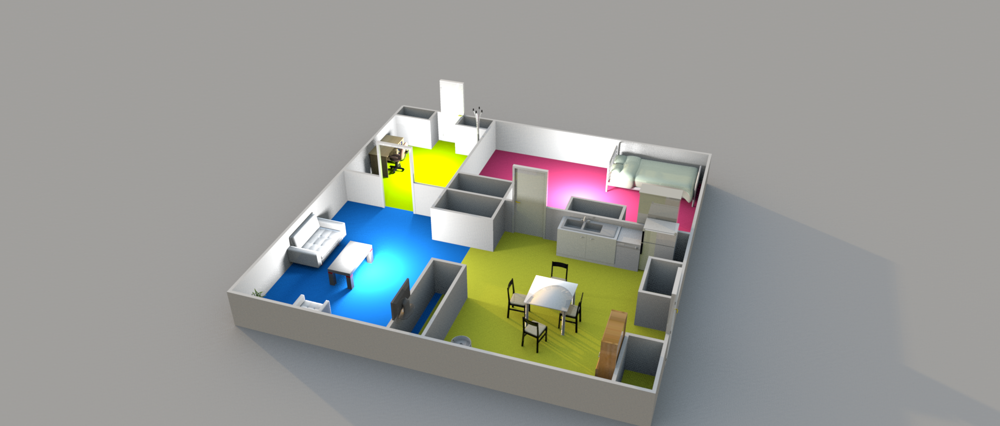
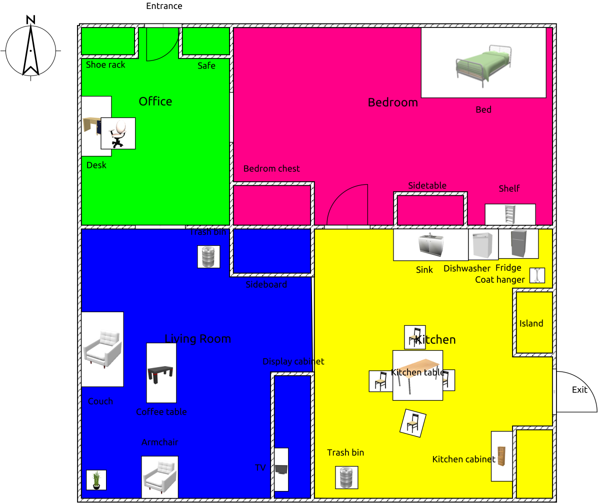

# RoboCup@Home 2019 Official Repository

Public data for the RoboCup@Home world championship 2019 taking place in Sydney, Australia

## Quick Links
- [Official Rulebook](https://github.com/RoboCupAtHome/Sydney2019/blob/master/Files/Rulebook.pdf)
- [Arena Map and locations](https://github.com/RoboCupAtHome/Sydney2019/#map)
    - [Special locations for specific tasks](https://github.com/RoboCupAtHome/Sydney2019/#special-locations)
- [List of Category Locations](https://github.com/RoboCupAtHome/Sydney2019/blob/master/Files/Categories.pdf)
- [List of Official Names](https://github.com/RoboCupAtHome/Sydney2019/blob/master/Files/Names.pdf)
- [List of Predefined Objects and Categories](https://github.com/RoboCupAtHome/Sydney2019/blob/master/Files/Objects.pdf)
- [List of Predefined Questions](https://github.com/RoboCupAtHome/Sydney2019/blob/master/Files/Questions.pdf)
- [Schedules](https://github.com/RoboCupAtHome/Sydney2019/#schedules)
- Scores

## Schedules
- [Competition main schedule](https://github.com/RoboCupAtHome/Sydney2019/blob/master/Files/Schedule-main.pdf)
- [Reserved-Arena-Usage Slots Schedule](https://github.com/RoboCupAtHome/Sydney2019/blob/master/Files/Schedule-reserved.pdf)
- [Robot Inspection and Poster-teaser Session](https://github.com/RoboCupAtHome/Sydney2019/blob/master/Files/Schedule-rips.pdf)
- [Stage I, Block 1 (Housekeeper) Team Order](https://github.com/RoboCupAtHome/Sydney2019/blob/master/Files/Schedule-Block1.pdf)
- [Stage I, Block 1 (Party Host) Team Order](https://github.com/RoboCupAtHome/Sydney2019/blob/master/Files/Schedule-Block2.pdf)

## F.A.Q.

- **Q: There is only one trashbin...**
    - **A:** _Yes, we know. There will be two trash bins available during the test (we will use one from other arena)._

- **Q: When will [whatever] be published?**
    - **A:** _[Soon](https://www.urbandictionary.com/define.php?term=soon) enough. We are recruiting volunteers to release it faster._

- **Q: Regarding [whatever] test...**
    - **A:** _Questions regarding specific tests will be answered during team leader meetings, the day before the test takes place._

## Map

## Special Locations
- [Start Locations for Party Host tasks in Stage I](https://github.com/RoboCupAtHome/Sydney2019/blob/master/Files/Locations-Partyhost1.pdf)
- [Special Locations for Housekeeper tasks in Stage I](https://github.com/RoboCupAtHome/Sydney2019/blob/master/Files/Locations-Housekeeper1.pdf)
- The location of the coat hanger is changed for Farewell, so that it's close to the exit:

## To register your devices in the team's VPN:

1. Connect to the “athome-onboard” network with a laptop.
2. Go to any website. It will redirect to the Onboarding page.
    - Ask for the login/pass at the OC desk
3. Once authenticated,  add the device MAC address (the form will auto-fill with the device MAC that they are currently using), give it a name, pick your team, and save.
4. Repeat the process with as many devices as needed.
